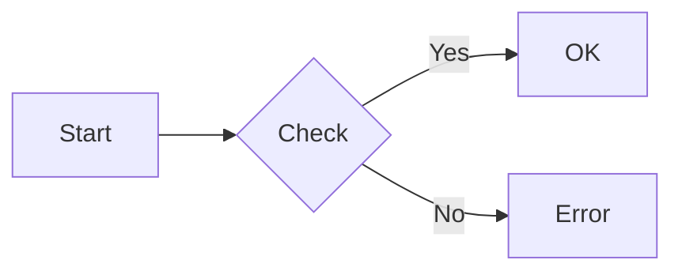

# MkDocs Setup Guide

This document provides a quick reference for the MkDocs documentation setup.

## Quick Start

```bash
# Install dependencies
pip install -r docs/requirements.txt

# Serve locally (with live reload)
mkdocs serve

# Build static site
mkdocs build

# Deploy to GitHub Pages
mkdocs gh-deploy
```

## Configuration Summary

### Location
- **Config file**: `mkdocs.yml`
- **Docs directory**: `docs/`
- **Build output**: `site/`

### Theme Settings
- **Theme**: Material for MkDocs
- **Default mode**: Dark mode (with toggle)
- **Primary color**: Deep Purple
- **Accent color**: Purple
- **Font**: Roboto / Roboto Mono

### Key Features Enabled
- Navigation tabs (sticky)
- Instant navigation with prefetch
- Search with suggestions
- Table of contents integration
- Code copy buttons
- Code annotations
- Edit/view page actions
- Git revision dates

### Plugins Configured
1. **search**: Enhanced search with smart separators
2. **git-revision-date-localized**: Shows page creation/modification dates
3. **minify**: Minifies HTML for production
4. **glightbox**: Image lightbox with zoom

### Markdown Extensions
- Admonitions (notes, warnings, tips)
- Code highlighting with line numbers
- Tabbed content blocks
- Task lists
- Mermaid diagrams
- Emojis
- Math equations (MathJax)
- Custom fences
- And more...

## Documentation Structure

```
docs/
├── index.md                    # Home page
├── getting-started/            # Installation, quickstart, config
├── cli/                        # CLI command reference
├── api/                        # API documentation
├── dashboard/                  # Web dashboard docs
├── desktop/                    # Desktop app docs
├── development/                # Development guides
├── architecture/               # Architecture docs
├── pools/                      # Pool integration
├── miners/                     # Miner-specific docs
├── troubleshooting/            # Troubleshooting guides
├── stylesheets/
│   └── extra.css              # Custom styles
├── requirements.txt           # Python dependencies
└── README.md                  # Docs contributor guide
```

## Deployment

### Automatic (GitHub Actions)
Documentation is automatically built and deployed to GitHub Pages on every push to `main` that modifies:
- `docs/**`
- `mkdocs.yml`
- `.github/workflows/docs.yml`

**Workflow**: `.github/workflows/docs.yml`

### Manual Deployment
```bash
# Build and deploy to gh-pages branch
mkdocs gh-deploy --force
```

## Viewing Documentation

### Local Development
- URL: `http://127.0.0.1:8000/`
- Command: `mkdocs serve`

### Production
- URL: `https://snider.github.io/Mining/`
- Branch: `gh-pages` (auto-generated)

## Adding New Pages

1. Create markdown file in appropriate directory:
   ```bash
   # Example: Add new CLI command documentation
   touch docs/cli/benchmark.md
   ```

2. Add to navigation in `mkdocs.yml`:
   ```yaml
   nav:
     - CLI Reference:
       - benchmark: cli/benchmark.md
   ```

3. Test locally:
   ```bash
   mkdocs serve
   ```

4. Commit and push (auto-deploys)

## Markdown Features

### Code Blocks with Highlighting
````markdown
```go title="main.go" linenums="1" hl_lines="2 3"
package main

import "fmt"

func main() {
    fmt.Println("Hello!")
}
```
````

### Admonitions
```markdown
!!! note "Note Title"
    This is a note admonition.

!!! warning "Warning"
    This is a warning.

!!! tip "Pro Tip"
    This is a helpful tip.
```

### Tabbed Content
```markdown
=== "Linux"
    ```bash
    ./miner-ctrl serve
    ```

=== "Windows"
    ```powershell
    miner-ctrl.exe serve
    ```
```

### Mermaid Diagrams
````markdown

````

## Troubleshooting

### Site not building?
```bash
# Check for errors
mkdocs build --strict --verbose
```

### Missing dependencies?
```bash
# Reinstall all dependencies
pip install -r docs/requirements.txt --force-reinstall
```

### Navigation not showing up?
- Check YAML syntax in `mkdocs.yml` nav section
- Ensure markdown files exist at specified paths
- Verify indentation (use spaces, not tabs)

### Changes not appearing locally?
- MkDocs has live reload, but try:
  - Hard refresh browser (Ctrl+Shift+R)
  - Restart `mkdocs serve`
  - Clear browser cache

## Resources

- [MkDocs Documentation](https://www.mkdocs.org/)
- [Material for MkDocs](https://squidfunk.github.io/mkdocs-material/)
- [PyMdown Extensions](https://facelessuser.github.io/pymdown-extensions/)
- [Mermaid Diagrams](https://mermaid-js.github.io/mermaid/)
