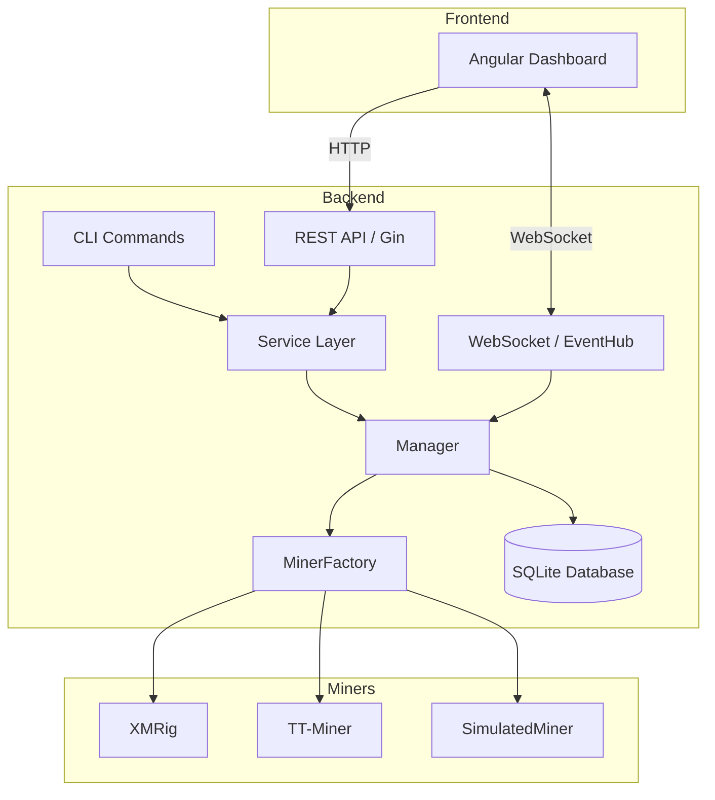
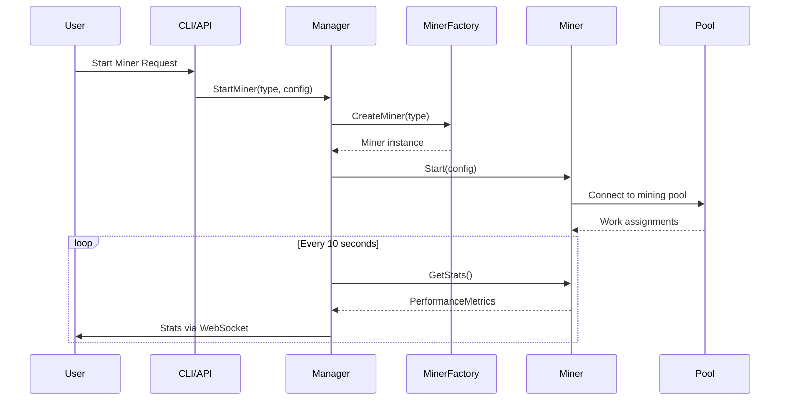
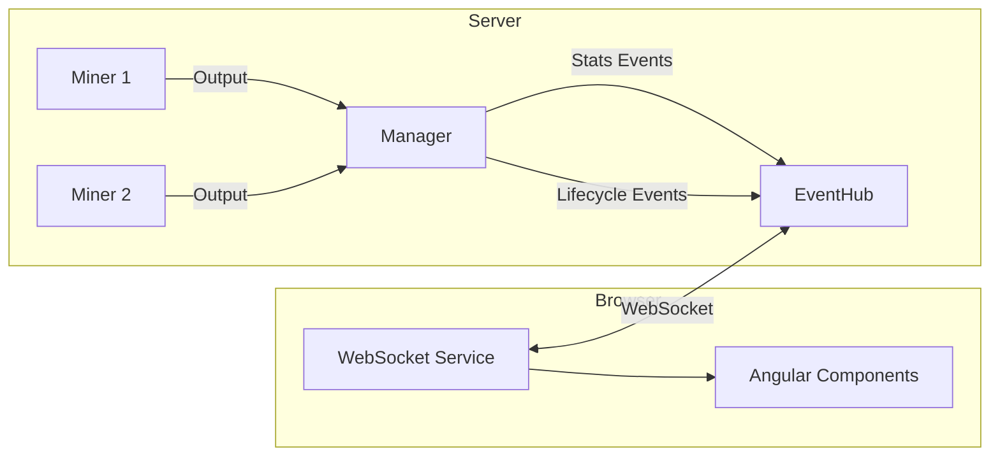

# Mining Architecture Guide

This document provides an overview of the architecture of the Mining project.

## High-Level Overview

The project is structured as a modular Go application. It consists of:
1.  **Core Library (`pkg/mining`)**: Contains the business logic for miner management.
2.  **CLI (`cmd/mining`)**: A command-line interface built with Cobra.
3.  **REST API**: A Gin-based web server exposed via the `serve` command.
4.  **Frontend**: An Angular-based dashboard for monitoring miners.



## Core Components

### Manager Interface
The core of the system is the `ManagerInterface` defined in `pkg/mining/manager_interface.go`. This interface abstracts the operations of starting, stopping, and monitoring miners.

```go
type ManagerInterface interface {
    StartMiner(minerType string, config *Config) (Miner, error)
    StopMiner(name string) error
    GetMiner(name string) (Miner, error)
    ListMiners() []Miner
    ListAvailableMiners() []AvailableMiner
    GetMinerHashrateHistory(name string) ([]HashratePoint, error)
    Stop()
}
```

This abstraction allows for:
- Easier testing (mocking the manager).
- Pluggable implementations (e.g., supporting different miner backends).

### Miner Interface
Each specific miner (e.g., XMRig) implements the `Miner` interface. This interface defines how to interact with the underlying miner executable process, parse its output, and control it.

The `XMRigMiner` implementation (`pkg/mining/xmrig.go`) handles:
- Downloading and verifying the miner binary.
- Generating configuration files.
- Executing the binary.
- Parsing stdout/stderr/API for stats.

### Service Layer
The `Service` struct (`pkg/mining/service.go`) wraps the `Manager` and exposes its functionality via a HTTP API using the Gin framework. It handles:
- Route registration.
- Request validation/binding.
- Response formatting.
- Swagger documentation generation.

## Directory Structure

- `cmd/mining/`: Entry point for the application.
- `pkg/mining/`: Core library code.
- `docs/`: Documentation and Swagger files.
- `ui/`: Source code for the Angular frontend.
- `dist/`: Build artifacts (binaries).

## Data Flow

1.  **User Action**: User issues a command via CLI or calls an API endpoint.
2.  **Service/CMD Layer**: The request is validated and passed to the `Manager`.
3.  **Manager Layer**: The manager looks up the appropriate `Miner` implementation.
4.  **Miner Layer**: The miner instance interacts with the OS (filesystem, processes).
5.  **Feedback**: Status and stats are returned up the stack to the user.



## Real-Time Communication

### WebSocket Events

The system uses WebSocket for real-time event delivery to the UI (`pkg/mining/events.go`):



**Event Types:**
- `miner.starting` / `miner.started` - Miner lifecycle
- `miner.stopping` / `miner.stopped` - Miner shutdown
- `miner.stats` - Periodic hashrate/share updates
- `miner.error` - Connection or pool errors
- `profile.*` - Profile CRUD events

The `EventHub` manages client connections with automatic cleanup on disconnect.

### Angular WebSocket Service

The frontend (`ui/src/app/websocket.service.ts`) maintains a persistent WebSocket connection with:
- Automatic reconnection with exponential backoff
- Event filtering by type
- Fallback to HTTP polling if WebSocket unavailable

## Simulation Mode

For development without mining hardware, the `SimulatedMiner` (`pkg/mining/simulated_miner.go`) provides:
- Realistic hashrate generation with variance and sine-wave fluctuation
- 30-second ramp-up period
- Simulated share acceptance (98% success rate)
- XMRig-compatible stats format for UI compatibility

Usage: `miner-ctrl simulate --count 3 --preset cpu-high`

## Supported Miners

The system is designed to support multiple mining software through a plugin architecture:

| Miner | Status | Type | API |
|-------|--------|------|-----|
| XMRig | Implemented | CPU/GPU | HTTP REST |
| TT-Miner | Implemented | NVIDIA GPU | HTTP |
| T-Rex | Planned | NVIDIA GPU | HTTP REST |
| lolMiner | Planned | AMD/NVIDIA/Intel | HTTP JSON |
| Rigel | Planned | NVIDIA GPU | HTTP REST |
| BzMiner | Planned | AMD/NVIDIA | HTTP |
| SRBMiner | Planned | CPU+GPU | HTTP |
| TeamRedMiner | Planned | AMD GPU | Claymore API |
| GMiner | Planned | GPU | HTTP |
| NBMiner | Planned | GPU | HTTP REST |
