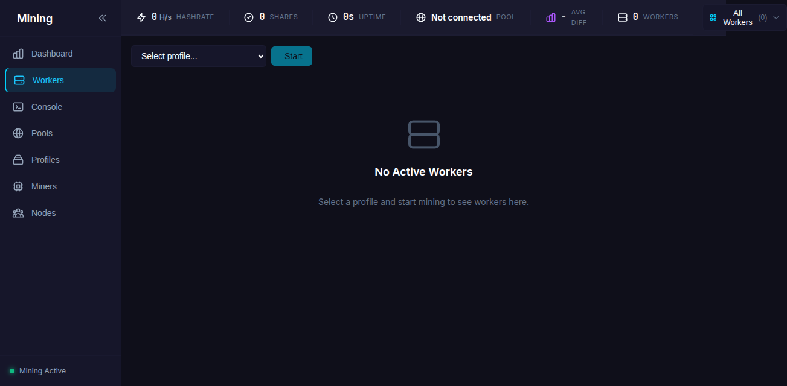
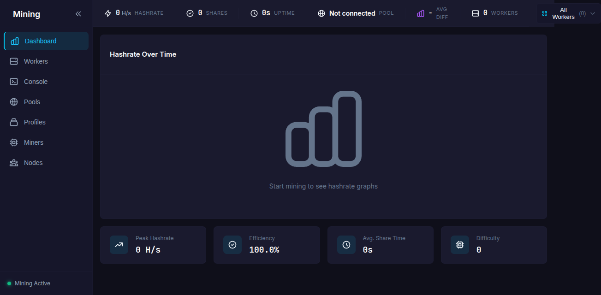

# Quick Start Guide

Get mining in 5 minutes with this quick start guide.

## Step 1: Start the Server

```bash
./miner-ctrl serve
```

This starts:
- REST API on port **9090**
- Web dashboard at [http://localhost:9090](http://localhost:9090)

## Step 2: Install a Miner

Navigate to **Miners** in the sidebar and click **Install** on XMRig (or TT-Miner for GPU mining).


The miner will be downloaded and extracted automatically.

## Step 3: Create a Profile

Go to **Profiles** and click **New Profile**:


Fill in:

| Field | Description | Example |
|-------|-------------|---------|
| **Profile Name** | Friendly name | "My XMR Pool" |
| **Miner Type** | Select miner | xmrig |
| **Pool Address** | Mining pool URL | pool.supportxmr.com:3333 |
| **Wallet Address** | Your XMR wallet | 4xxx... |
| **TLS** | Enable encryption | ✓ Recommended |

Click **Create Profile**.

## Step 4: Start Mining

Two ways to start:

1. **From Profiles**: Click the **Start** button on your profile card
2. **From Workers**: Select a profile from the dropdown and click **Start**



## Step 5: Monitor Your Miner

### Dashboard

The **Dashboard** shows real-time stats:



- **Hashrate** - Current mining speed
- **Shares** - Accepted/rejected shares
- **Uptime** - How long the miner has been running
- **Avg Diff** - Average difficulty per share
- **Pool** - Connected pool

### Console

View live miner output in the **Console**:


Send commands to the miner using the input field:

| Command | Action |
|---------|--------|
| `h` | Show hashrate |
| `p` | Pause mining |
| `r` | Resume mining |
| `s` | Show results |
| `c` | Show connection info |

## Common Pool Addresses

| Pool | Address |
|------|---------|
| SupportXMR | `pool.supportxmr.com:3333` |
| MoneroOcean | `gulf.moneroocean.stream:10128` |
| 2Miners | `xmr.2miners.com:2222` |
| HashVault | `pool.hashvault.pro:3333` |

## Next Steps

- [Mining Profiles](../features/profiles.md) - Advanced profile configuration
- [Console & Logs](../features/console.md) - Using the console
- [Multi-Node Setup](../features/p2p-multinode.md) - Control remote rigs
