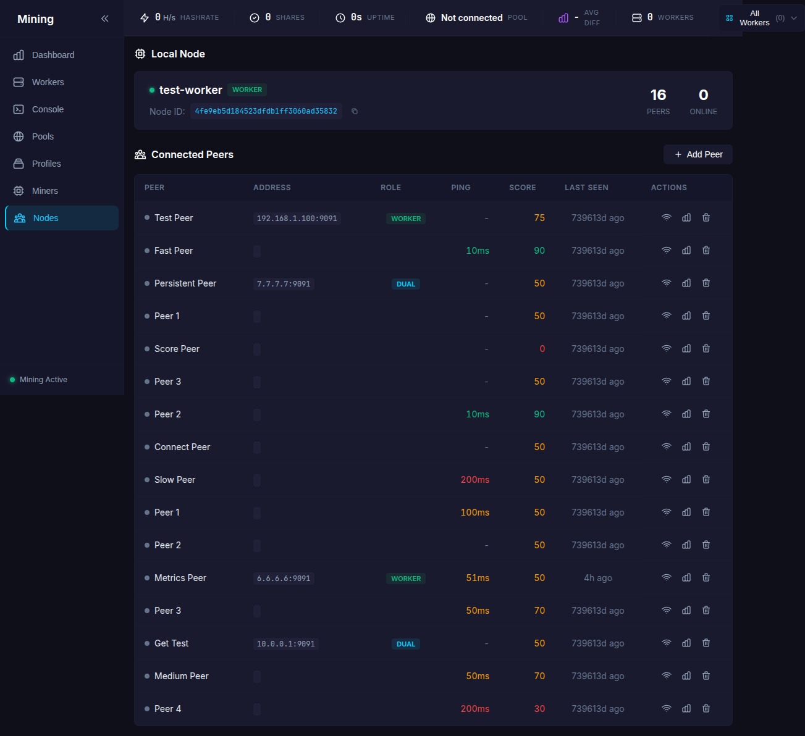
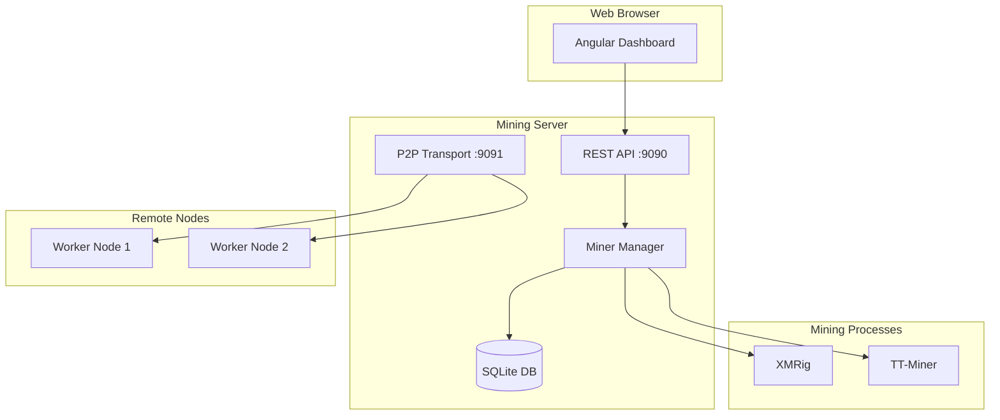

# Mining Dashboard

<div style="text-align: center; margin: 2rem 0;">

</div>

**Mining Dashboard** is a powerful, open-source multi-miner management system that lets you control XMRig, TT-Miner, and other mining software from a single, beautiful web interface.

!!! tip "Built with Claude Code"
    This entire project—backend, frontend, documentation, and tests—was developed using [Claude Code](https://claude.ai/code), Anthropic's AI-powered development assistant. See [how Claude helped build this](about/claude.md).

## Key Features

<div class="grid cards" markdown>

-   :material-lightning-bolt:{ .lg .middle } **Real-time Monitoring**

    ---

    Live hashrate graphs, share statistics, and performance metrics updated every 5 seconds

-   :material-cog:{ .lg .middle } **Multi-Miner Support**

    ---

    Control XMRig (CPU) and TT-Miner (GPU) from a unified interface. Easy to extend for additional miners

-   :material-console:{ .lg .middle } **Console Access**

    ---

    Full console output with ANSI color support and stdin input for miner commands

-   :material-server-network:{ .lg .middle } **P2P Multi-Node**

    ---

    Control remote mining rigs via encrypted WebSocket connections without cloud dependencies

-   :material-database:{ .lg .middle } **Historical Data**

    ---

    SQLite-backed hashrate history with configurable retention (5m to 24h views)

-   :material-api:{ .lg .middle } **REST API**

    ---

    Full REST API with Swagger documentation for automation and integration

</div>

## Quick Start

```bash
# Clone the repository
git clone https://github.com/Snider/Mining.git
cd Mining

# Build the CLI
make build

# Start the server
./miner-ctrl serve
```

Then open [http://localhost:9090](http://localhost:9090) in your browser!

## Screenshots

<div class="grid" markdown>

{ loading=lazy }

{ loading=lazy }

{ loading=lazy }

{ loading=lazy }

</div>

## Architecture

The Mining Dashboard consists of:

- **Go Backend** - REST API server with miner process management
- **Angular Frontend** - Modern, responsive web interface
- **SQLite Database** - Persistent hashrate history storage
- **P2P Network** - Encrypted node-to-node communication



## Support

- **GitHub Issues**: [Report bugs or request features](https://github.com/Snider/Mining/issues)
- **Documentation**: You're reading it!

## License

This project is open source. See the repository for license details.
